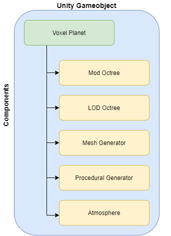
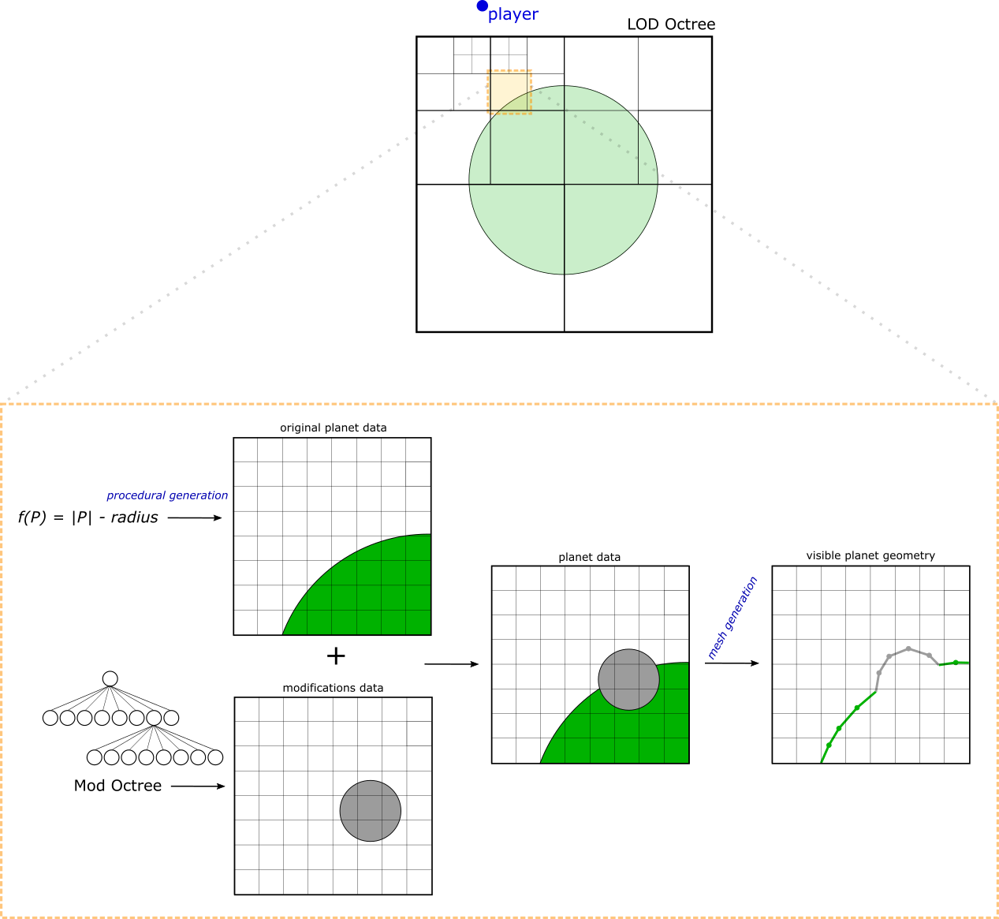
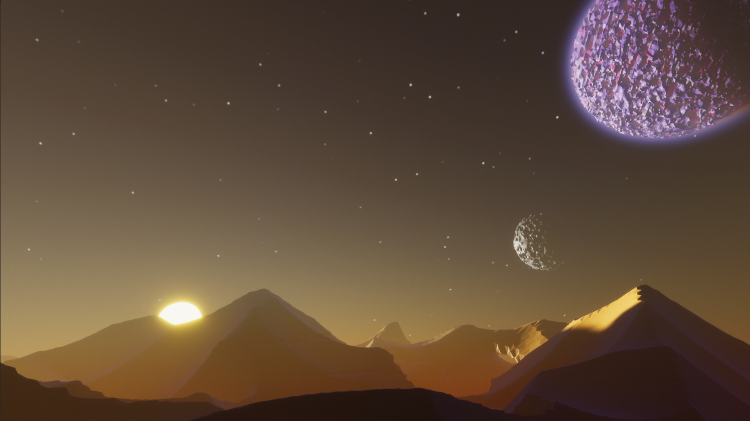
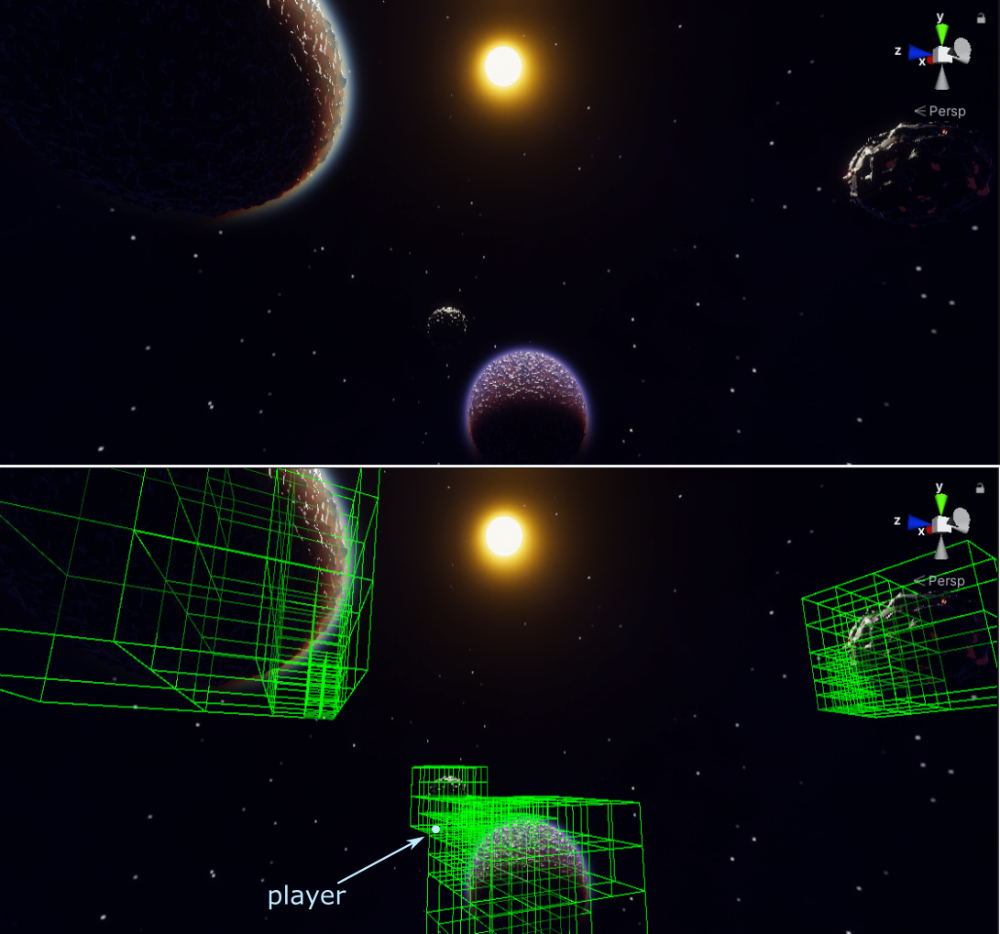
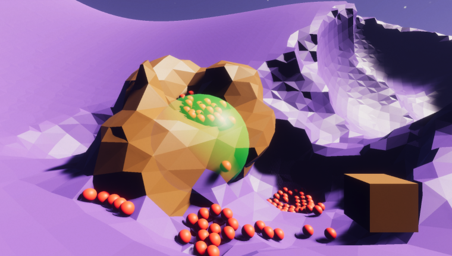

# Voxel Planets

This project offers an implementation in Unity on the problem of generating and handling planets with dynamic terrain, inspired by the videogame Astroneer. 

The most relevant code can be found in [Assets/Scripts/VoxelPlanet](https://github.com/josebasierra/voxel-planets/tree/master/Assets/Scripts/VoxelPlanet). 

You can find an explanation about the main concepts and ideas behind the implementation in https://josebasierra.gitlab.io/VoxelPlanets

## Overview

## Instructions 
Unity Project: 
- Version 2020.3  
- High Definition Render Pipeline (HDRP)  

To play the demo, download the Demo.zip and execute VoxelPlanets.exe. 

Recommended hardware to play the demo (1920x1080, 60 fps):
- Intel i5 8400 or equivalent
- Nvidia GTX 1060 or equivalent
- 1-2 GB free RAM

## Some screenshots

